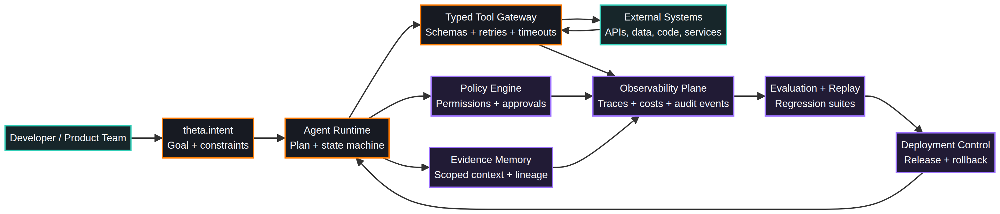
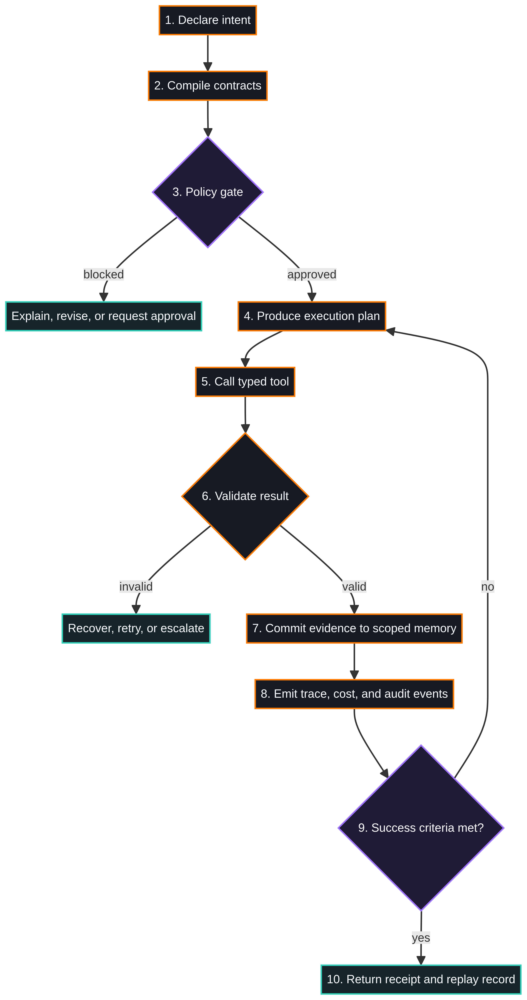
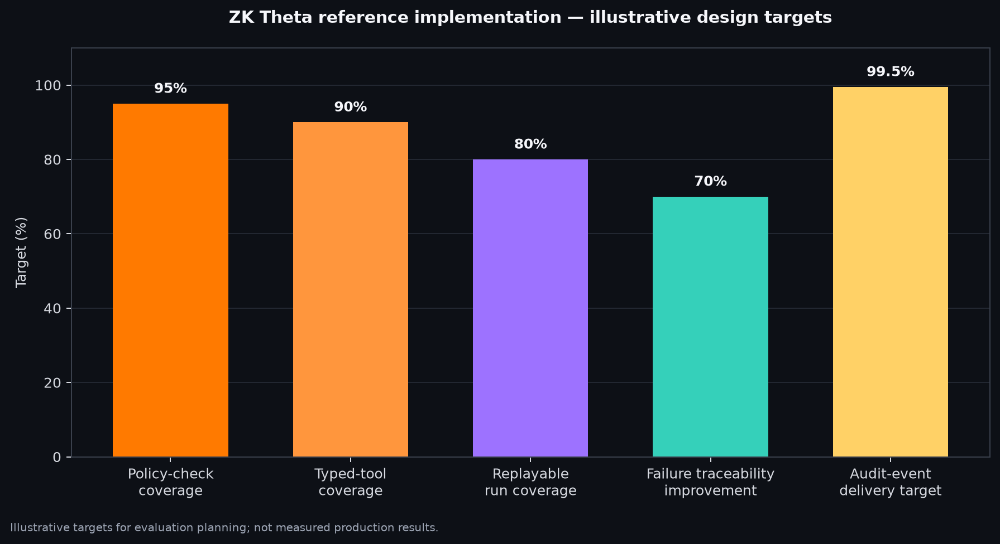

# ZK Theta Language — Developer AI Agent Framework

<p align="center">
  
</p>

<p align="center">
  <strong>Typed intent. Policy-gated execution. Evidence-bound memory. Observable agent workflows.</strong>
</p>

<p align="center">
  
  
  
  
</p>

<p align="center">
  
</p>

<p align="center">
  
</p>

<p align="center">
  
</p>

ZK Theta is a proposed language and runtime framework for building trustworthy, observable AI agents. It gives developers explicit constructs for intent, constraints, typed tools, policy gates, evidence-bound memory, evaluation, and deployment telemetry.

> This repository contains a design proposal and reference materials. ZK Theta is not presented as an existing public standard, and the metrics in the accompanying PDF are illustrative design targets rather than measured production results.

## Contents

The main deliverable is [`docs/zk-theta-framework.pdf`](docs/zk-theta-framework.pdf). The editable narrative is in [`docs/framework.md`](docs/framework.md). The proposed cryptography and verification boundary are documented in [`docs/cryptography.md`](docs/cryptography.md). Architecture and runtime lifecycle diagrams are maintained as Mermaid sources under [`diagrams/`](diagrams/), with rendered PNG assets under [`assets/`](assets/).

## Multi-agent workflow example

The complete workflow is [`examples/multi_agent_workflow.theta`](examples/multi_agent_workflow.theta). It defines four agents—Planner, Researcher, Verifier, and Promoter—connected by a policy-gated pipeline. Because the Theta language is currently a proposal, the `.theta` file is not compiled by a production Theta compiler yet. The runnable reference implementation is [`examples/run_reference.py`](examples/run_reference.py):

```bash
python3 examples/run_reference.py
```

The runner executes the workflow with standard-library Python, checks the evidence assertions and approval gate, and writes `examples/run_receipt.json` containing a hash-linked audit record. It is a reference simulation, not a zero-knowledge proof implementation.

## Cryptography status

ZK Theta currently implements no zero-knowledge proof system. The proposed suite is modular: SHA-256 or SHAKE256 for domain-separated commitments and transcript hashing; a transparent STARK-style proof system for state-transition validity; Fiat–Shamir for non-interactive challenges; Merkle commitments for ordered evidence logs; ML-DSA for post-quantum signatures; and ML-KEM for post-quantum key establishment. No primitive by itself guarantees zero knowledge, and the proposal does not claim that these primitives have been integrated or audited. See [`docs/cryptography.md`](docs/cryptography.md).

## Design pillars

| Pillar | Purpose |
| --- | --- |
| Intent-first syntax | Make goals, constraints, and success criteria explicit. |
| Typed tool contracts | Make external actions schema-driven, bounded, and auditable. |
| Policy-native execution | Enforce permissions, approvals, privacy, and budget rules at runtime. |
| Evidence-bound memory | Keep observations, inferences, and durable facts separated. |
| Evaluation loops | Regression-test plans, tools, grounding, cost, and latency. |
| Deployment observability | Emit traces, lineage, receipts, and audit events by default. |

## Status

The current repository is a concept specification and visual reference package. A future implementation should begin with a small runtime slice: compile one agent definition, execute mocked typed tools, enforce one approval gate, and emit a replayable trace.

## License

The proposal and source materials are released under the MIT License. See [`LICENSE`](LICENSE).
